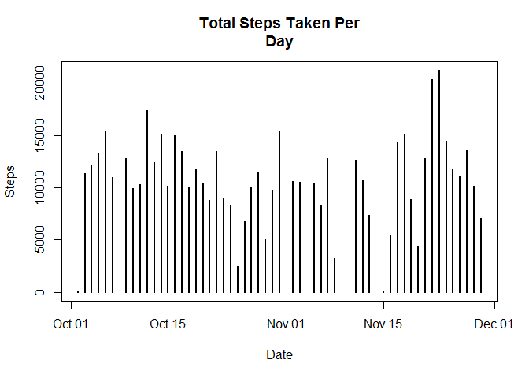
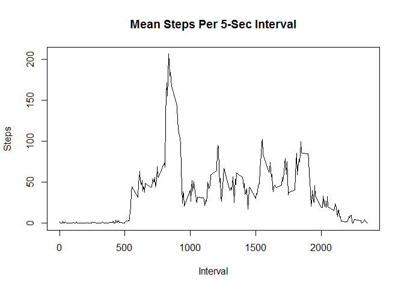
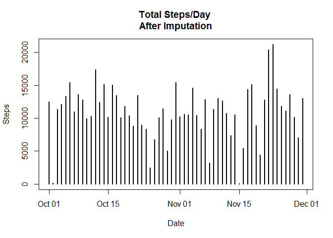
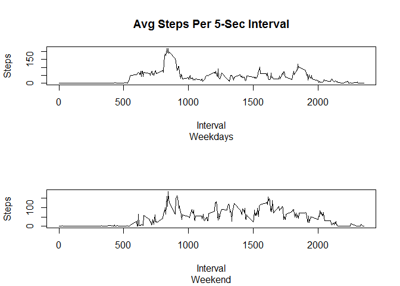

# Reproducible Research: Peer Assessment 1


# Loading and Processing Data


```r
#load data 
path<-"~/coursera/repdata_data_activity/activity.csv"
activity<-read.csv(file=path,
colClasses=c("integer", "Date", "integer"))
#remove na
steps<-na.omit(activity)
```

# What is the mean total of steps taken per day?


```r
#sum steps by date, calculate mean and median
sum_steps<-aggregate(steps~date, steps, sum)
mean_steps<-aggregate(steps~date, steps, mean)
median_steps<-aggregate(steps~date, steps, median)
```

The mean total of steps taken per day is:

```
##          date      steps
## 1  2012-10-02  0.4375000
## 2  2012-10-03 39.4166667
## 3  2012-10-04 42.0694444
## 4  2012-10-05 46.1597222
## 5  2012-10-06 53.5416667
## 6  2012-10-07 38.2465278
## 7  2012-10-09 44.4826389
## 8  2012-10-10 34.3750000
## 9  2012-10-11 35.7777778
## 10 2012-10-12 60.3541667
## 11 2012-10-13 43.1458333
## 12 2012-10-14 52.4236111
## 13 2012-10-15 35.2048611
## 14 2012-10-16 52.3750000
## 15 2012-10-17 46.7083333
## 16 2012-10-18 34.9166667
## 17 2012-10-19 41.0729167
## 18 2012-10-20 36.0937500
## 19 2012-10-21 30.6284722
## 20 2012-10-22 46.7361111
## 21 2012-10-23 30.9652778
## 22 2012-10-24 29.0104167
## 23 2012-10-25  8.6527778
## 24 2012-10-26 23.5347222
## 25 2012-10-27 35.1354167
## 26 2012-10-28 39.7847222
## 27 2012-10-29 17.4236111
## 28 2012-10-30 34.0937500
## 29 2012-10-31 53.5208333
## 30 2012-11-02 36.8055556
## 31 2012-11-03 36.7048611
## 32 2012-11-05 36.2465278
## 33 2012-11-06 28.9375000
## 34 2012-11-07 44.7326389
## 35 2012-11-08 11.1770833
## 36 2012-11-11 43.7777778
## 37 2012-11-12 37.3784722
## 38 2012-11-13 25.4722222
## 39 2012-11-15  0.1423611
## 40 2012-11-16 18.8923611
## 41 2012-11-17 49.7881944
## 42 2012-11-18 52.4652778
## 43 2012-11-19 30.6979167
## 44 2012-11-20 15.5277778
## 45 2012-11-21 44.3993056
## 46 2012-11-22 70.9270833
## 47 2012-11-23 73.5902778
## 48 2012-11-24 50.2708333
## 49 2012-11-25 41.0902778
## 50 2012-11-26 38.7569444
## 51 2012-11-27 47.3819444
## 52 2012-11-28 35.3576389
## 53 2012-11-29 24.4687500
```

The median is:

```
##          date steps
## 1  2012-10-02     0
## 2  2012-10-03     0
## 3  2012-10-04     0
## 4  2012-10-05     0
## 5  2012-10-06     0
## 6  2012-10-07     0
## 7  2012-10-09     0
## 8  2012-10-10     0
## 9  2012-10-11     0
## 10 2012-10-12     0
## 11 2012-10-13     0
## 12 2012-10-14     0
## 13 2012-10-15     0
## 14 2012-10-16     0
## 15 2012-10-17     0
## 16 2012-10-18     0
## 17 2012-10-19     0
## 18 2012-10-20     0
## 19 2012-10-21     0
## 20 2012-10-22     0
## 21 2012-10-23     0
## 22 2012-10-24     0
## 23 2012-10-25     0
## 24 2012-10-26     0
## 25 2012-10-27     0
## 26 2012-10-28     0
## 27 2012-10-29     0
## 28 2012-10-30     0
## 29 2012-10-31     0
## 30 2012-11-02     0
## 31 2012-11-03     0
## 32 2012-11-05     0
## 33 2012-11-06     0
## 34 2012-11-07     0
## 35 2012-11-08     0
## 36 2012-11-11     0
## 37 2012-11-12     0
## 38 2012-11-13     0
## 39 2012-11-15     0
## 40 2012-11-16     0
## 41 2012-11-17     0
## 42 2012-11-18     0
## 43 2012-11-19     0
## 44 2012-11-20     0
## 45 2012-11-21     0
## 46 2012-11-22     0
## 47 2012-11-23     0
## 48 2012-11-24     0
## 49 2012-11-25     0
## 50 2012-11-26     0
## 51 2012-11-27     0
## 52 2012-11-28     0
## 53 2012-11-29     0
```


Here is a histogram of the total steps taken per day


```r
plot(sum_steps, type="h", main="Total Steps Taken Per
Day", xlab="Date", ylab="Steps", lwd=2)
```

<!-- -->


# What is the average daily activity pattern?
Here is a time series plot of the average number of steps taken per 5 minute interval averaged across all days:

```r
#create avg steps by interval across all days
mean_interval<-aggregate(steps~interval, 
steps, mean)

#plot line graph and return interval w/max steps
plot(mean_interval, type="l", main=
"Mean Steps Per 5-Sec Interval", 
xlab="Interval", ylab="Steps")
```

<!-- -->

```r
max_interval<-mean_interval$interval[mean_interval$steps==max(mean_interval$steps)]
```

The 5 minute interval with the maximum number of steps is:


```
## [1] 835
```

# Imputing missing values


```r
#calculate total NA's in "activity"
totalNA<-sum(is.na(activity$steps))
```

The total number of NA's in dataset is:


```
## [1] 2304
```


```r
#replace missing values and recalculate sum, mean and ##median steps, plot new steps/day
library(mice)
newframe<-subset(activity, 
subset=, select=c("steps", "interval"))
imp<-mice(newframe, m=5, method="pmm", seed=500)
```

```
## 
##  iter imp variable
##   1   1  steps
##   1   2  steps
##   1   3  steps
##   1   4  steps
##   1   5  steps
##   2   1  steps
##   2   2  steps
##   2   3  steps
##   2   4  steps
##   2   5  steps
##   3   1  steps
##   3   2  steps
##   3   3  steps
##   3   4  steps
##   3   5  steps
##   4   1  steps
##   4   2  steps
##   4   3  steps
##   4   4  steps
##   4   5  steps
##   5   1  steps
##   5   2  steps
##   5   3  steps
##   5   4  steps
##   5   5  steps
```

```r
newframe2<-complete(imp,1)
Date<-activity$date
new_activity<-cbind(newframe2, Date)
sum_steps2<-aggregate(steps~Date,
                      new_activity, sum)
mean_steps2<-aggregate(steps~Date, 
new_activity, mean)
median_steps2<-aggregate(steps~Date, 
new_activity, median)
```

Here is a histogram of of the total steps taken each day after imputation of missing data:

```r
plot(sum_steps2, type="h", main="Total Steps/Day 
After Imputation", xlab="Date", ylab="Steps", 
lwd=2)
```

<!-- -->

The mean steps taken per day after imputing missing data is:

```
##          Date      steps
## 1  2012-10-01 43.4583333
## 2  2012-10-02  0.4375000
## 3  2012-10-03 39.4166667
## 4  2012-10-04 42.0694444
## 5  2012-10-05 46.1597222
## 6  2012-10-06 53.5416667
## 7  2012-10-07 38.2465278
## 8  2012-10-08 47.3784722
## 9  2012-10-09 44.4826389
## 10 2012-10-10 34.3750000
## 11 2012-10-11 35.7777778
## 12 2012-10-12 60.3541667
## 13 2012-10-13 43.1458333
## 14 2012-10-14 52.4236111
## 15 2012-10-15 35.2048611
## 16 2012-10-16 52.3750000
## 17 2012-10-17 46.7083333
## 18 2012-10-18 34.9166667
## 19 2012-10-19 41.0729167
## 20 2012-10-20 36.0937500
## 21 2012-10-21 30.6284722
## 22 2012-10-22 46.7361111
## 23 2012-10-23 30.9652778
## 24 2012-10-24 29.0104167
## 25 2012-10-25  8.6527778
## 26 2012-10-26 23.5347222
## 27 2012-10-27 35.1354167
## 28 2012-10-28 39.7847222
## 29 2012-10-29 17.4236111
## 30 2012-10-30 34.0937500
## 31 2012-10-31 53.5208333
## 32 2012-11-01 35.6388889
## 33 2012-11-02 36.8055556
## 34 2012-11-03 36.7048611
## 35 2012-11-04 50.6076389
## 36 2012-11-05 36.2465278
## 37 2012-11-06 28.9375000
## 38 2012-11-07 44.7326389
## 39 2012-11-08 11.1770833
## 40 2012-11-09 39.5625000
## 41 2012-11-10 45.1805556
## 42 2012-11-11 43.7777778
## 43 2012-11-12 37.3784722
## 44 2012-11-13 25.4722222
## 45 2012-11-14 36.5798611
## 46 2012-11-15  0.1423611
## 47 2012-11-16 18.8923611
## 48 2012-11-17 49.7881944
## 49 2012-11-18 52.4652778
## 50 2012-11-19 30.6979167
## 51 2012-11-20 15.5277778
## 52 2012-11-21 44.3993056
## 53 2012-11-22 70.9270833
## 54 2012-11-23 73.5902778
## 55 2012-11-24 50.2708333
## 56 2012-11-25 41.0902778
## 57 2012-11-26 38.7569444
## 58 2012-11-27 47.3819444
## 59 2012-11-28 35.3576389
## 60 2012-11-29 24.4687500
## 61 2012-11-30 45.1250000
```
The median steps taken per day after imputating missing data is:

```
##          Date steps
## 1  2012-10-01     0
## 2  2012-10-02     0
## 3  2012-10-03     0
## 4  2012-10-04     0
## 5  2012-10-05     0
## 6  2012-10-06     0
## 7  2012-10-07     0
## 8  2012-10-08     0
## 9  2012-10-09     0
## 10 2012-10-10     0
## 11 2012-10-11     0
## 12 2012-10-12     0
## 13 2012-10-13     0
## 14 2012-10-14     0
## 15 2012-10-15     0
## 16 2012-10-16     0
## 17 2012-10-17     0
## 18 2012-10-18     0
## 19 2012-10-19     0
## 20 2012-10-20     0
## 21 2012-10-21     0
## 22 2012-10-22     0
## 23 2012-10-23     0
## 24 2012-10-24     0
## 25 2012-10-25     0
## 26 2012-10-26     0
## 27 2012-10-27     0
## 28 2012-10-28     0
## 29 2012-10-29     0
## 30 2012-10-30     0
## 31 2012-10-31     0
## 32 2012-11-01     0
## 33 2012-11-02     0
## 34 2012-11-03     0
## 35 2012-11-04     0
## 36 2012-11-05     0
## 37 2012-11-06     0
## 38 2012-11-07     0
## 39 2012-11-08     0
## 40 2012-11-09     0
## 41 2012-11-10     0
## 42 2012-11-11     0
## 43 2012-11-12     0
## 44 2012-11-13     0
## 45 2012-11-14     0
## 46 2012-11-15     0
## 47 2012-11-16     0
## 48 2012-11-17     0
## 49 2012-11-18     0
## 50 2012-11-19     0
## 51 2012-11-20     0
## 52 2012-11-21     0
## 53 2012-11-22     0
## 54 2012-11-23     0
## 55 2012-11-24     0
## 56 2012-11-25     0
## 57 2012-11-26     0
## 58 2012-11-27     0
## 59 2012-11-28     0
## 60 2012-11-29     0
## 61 2012-11-30     0
```

#Are there differences in patterns between weekdays and weekends?


```r
#add new column to note weekday or weekend
weekdays<-weekdays(new_activity$Date, 
                   abbreviate=FALSE)

weekdays<-ifelse(weekdays %in% 
  c("Saturday","Sunday"), "Weekend", weekdays)
weekdays<-ifelse(weekdays%in% c("Monday", 
"Tuesday", "Wednesday", "Thursday", "Friday"), 
"Weekday", weekdays)

new_frame3<-cbind(new_activity, weekdays)

#new data frames for weekdays and weekends and 

MTWRF<-subset(new_frame3, subset=weekdays==
"Weekday",select=c("steps", "interval", 
                   "weekdays"))
SS<-subset(new_frame3, subset=weekdays==
"Weekend", select=c("steps", "interval", 
                    "weekdays"))
newSS<-aggregate(steps~interval, SS, mean)
newMTWRF<-aggregate(steps~interval, MTWRF, mean)
```

Here is a time series plot of the average numer of steps taken per 5 minute interval averaged across weekdays and weekends:

```r
#plot mean steps by interval
par(mfrow=2:1)
plot(x=newMTWRF$interval, y=newMTWRF$steps, 
     type="l", main="Avg Steps Per 5-Sec Interval",
     sub="Weekdays", xlab="Interval", ylab="Steps")

plot(x=newSS$interval, y=newSS$steps, type="l", 
     sub="Weekend", xlab="Interval", ylab="Steps")
```

<!-- -->

This individual seems to be more active, in general terms, on the weekend than on weekdays.  They maintain a higher average number of steps on the weekend compared to weekdays for almost every 5 second interval. 
